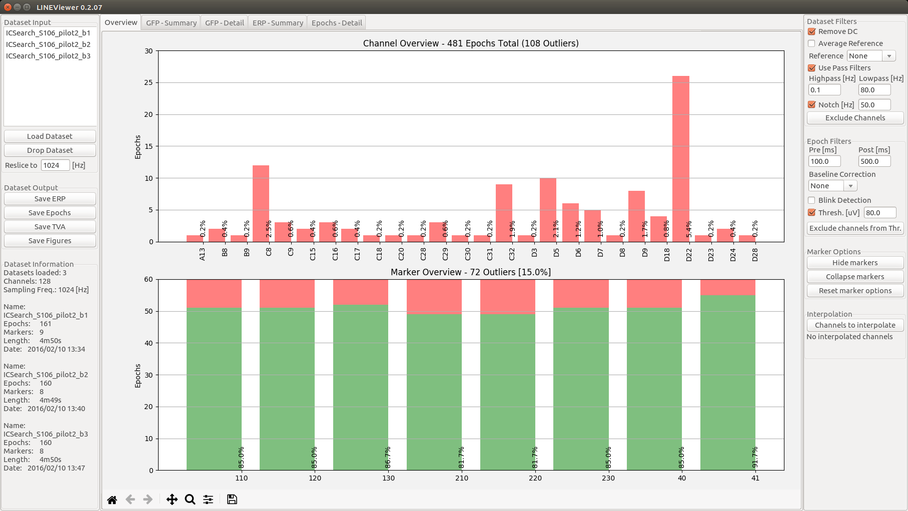

==========
LINEViewer
==========

.. |logo| image:: lineviewer/static/favicon_256.ico
   :width: 256pt

.. |introText| replace:: LINEViewer is a python based EEG analysis toolbox that helps you to get a first impression of your data. The softwares is very fast in analysing your data and can compute subject averages of hour long datasets within seconds. LINEViewer provides all the preprocessing options that you know from other EEG analysis softwares.

+-------------+--------+
| |introText| | |logo| |
+-------------+--------+

As you can see in the example above, LINEViewer gives you a fast and general information about the quality of your data. Given a specific threshold value, LINEViewer tells you how many events you could keep per marker (lower part of figure) and how many times a given electrode is above a certain threshold (upper part of figure). With this fully automatic way, you can have preliminary epoch averages for hour long recordings within a few seconds.

Citation
--------

.. image:: https://zenodo.org/badge/doi/10.5281/zenodo.593318.svg
   :target: http://doi.org/10.5281/zenodo.593318

If you used LINEViewer in your project, please cite as: Notter, Michael P., & Murray, Micah M. (2017). LINEViewer: a Python based EEG analysis tool for a rough data overview. Zenodo. `http://doi.org/10.5281/zenodo.593318 <http://doi.org/10.5281/zenodo.593318>`_.

Installation
-------------

LINEViewer is distributed via https://github.com/miykael/LINEViewer/. You can download the newest version under `releases <https://github.com/miykael/LINEViewer/releases>`_.

The software has the following dependencies:

* `python 2.7 <https://www.python.org/download/releases/2.7/>`_
* `matplotlib <http://matplotlib.org/>`_: version 1.5 or higher
* `numpy <http://www.numpy.org/>`_: version 1.9 or higher
* `scipy <http://www.scipy.org/>`_: version 0.16 or higher
* `scikit-learn <http://scikit-learn.org/stable/>`_: version 0.17 or higher
* `wxpython <http://wiki.wxpython.org/How%20to%20install%20wxPython>`_: version 3.0 or higher

Full distributions like `Anaconda <https://www.continuum.io/why-anaconda>`_ provide all those packages, except `wxpython v3.0 <http://wiki.wxpython.org/How%20to%20install%20wxPython>`_.

Windows
*******
1. Download and install the newest `Anaconda <https://www.continuum.io/downloads>`_ distribution that includes Python 2.7.
2. Download and run `LINEViewer.exe <https://github.com/miykael/LINEViewer/releases>`_. The first time, it will take some time to open as it first needs to install all necessary packages.

Alternatively, you can also use the installation instruction for Linux / iOS on a Windows machine - as long as you have `Anaconda <https://www.continuum.io/why-anaconda>`_ on your system.

To **uninstall** lineviewer use the following command: ``conda remove -n lineviewer-2.7 --all --yes``

Linux / iOS
***********

1. Download and install the `newest Anaconda distribution that includes Python 2.7 <https://www.continuum.io/downloads>`_.
2. Create a conda environment with python 2.7:  ``conda create -y -n lineviewer-2.7 python=2.7 pip ipython matplotlib numpy scikit-learn scipy wxpython``
3. Activate lineviewer environment: ``source activate lineviewer-2.7``
4. Install LINEViewer via pip: ``pip install --upgrade lineviewer``
5. Start LINEViewer with: ``ipython --c "import lineviewer; lineviewer.gui()"``

To **uninstall** lineviewer use the following command: ``conda remove -n lineviewer-2.7 --all --yes``

LINEViewer structure
--------------------

* ``bin/``: Contains the executables for Windows, as well as the corresponding batch files
* ``lineviewer/``: Contains the source code
* ``LICENSE``: LINEViewer license terms
* ``README``: This document
* ``setup.py``: Script for building and installing LINEViewer

License information
-------------------

The full license is in the file ``LICENSE``. The image of the brain in the logo was created with `MRIcroGL <http://www.mccauslandcenter.sc.edu/mricrogl/>`_ and the font used is called Ethnocentric Regular, created and licensed by Ray Larabie (http://typodermicfonts.com/).

